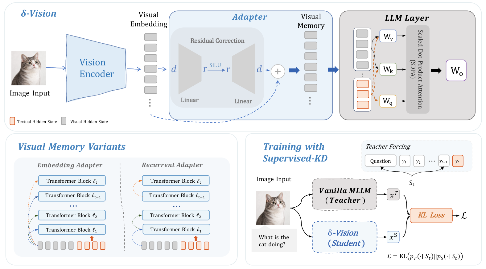

<div align="center">

# δ-Vision

### Just MLPs: Efficient Visual State Reconstruction for Multimodal Language Models

Jingdi Lei, Junxian Li, Di Zhang, Zhanqiu Zhang, Yiwen Guo, and Soujanya Poria

Preserve every visual token with lightweight, layer-wise visual memory prediction.

</div>

<p align="center">
  <a href="https://creativecommons.org/licenses/by/4.0/"></a>
  <a href="https://arxiv.org/abs/2609.34972"></a>
  <a href="https://huggingface.co/huaXiaKyrie/delta-Vision-Embedding-Adapter"></a>
  <a href="https://huggingface.co/datasets/huaXiaKyrie/pixmo-ama-train"></a>
</p>

## Overview

δ-Vision reduces the cost of processing long visual sequences in multimodal language models. It replaces repeated visual-token Transformer updates with small, low-rank residual MLPs that construct the visual memory needed at each layer. Text tokens retrieve information from **all visual tokens** through the original frozen key and value projections, while visual queries, visual attention outputs, and visual feed-forward updates are skipped in the Transformer attention path.

Only the adapters are trained; the vision encoder, multimodal projector, and language-model backbone remain frozen. The repository includes implementations for Qwen3-VL, LLaVA, and the Qwen3.5 hybrid architecture. The quick start below uses **Qwen3-VL-4B-Instruct with the embedding adapter**.

## Pipeline

<p align="center">
  
</p>

1. **Encode the visual input.** The frozen vision encoder and projector produce the initial visual embeddings $E$.
2. **Construct layer-wise visual memory.** Each adapter applies a low-rank residual correction, $A_l(X) = X + \mathrm{SiLU}(XD_l)U_l$. The embedding variant predicts $M_l = A_l(E)$ independently at every layer. The recurrent variant uses $M_l = A_l(M_{l-1})$, starting from $M_0 = E$.
3. **Retrieve visual context.** The original layer normalization and K/V projections map each memory into visual context. Text queries attend to visual and text keys/values, then follow the original language-model computation. Visual token counts and positions are preserved.
4. **Train with Supervised-KD.** A frozen vanilla model supervises the student with token-level forward KL divergence under teacher forcing on ground-truth answers. Gradients update only the adapters.

The low-rank bottleneck constrains the residual update; the visual memory retains the full hidden dimension. For Qwen3.5, the implementation also handles its Gated DeltaNet state updates.

## Installation

Use Python 3.11+ and an NVIDIA GPU environment with BF16 support and a CUDA toolkit compatible with your PyTorch installation. Run all commands from the repository root.

```bash
python3.11 -m venv .venv
source .venv/bin/activate
python -m pip install --upgrade pip
python -m pip install torch==2.11.0 torchvision==0.26.0 \
  --index-url https://download.pytorch.org/whl/cu129
python -m pip install -e .
python -m pip install packaging ninja
python -m pip install flash-attn==2.8.3.post1 --no-build-isolation
```

Core dependencies are defined in [pyproject.toml](pyproject.toml). The default training configuration uses BF16, FlashAttention-2, and DeepSpeed ZeRO-2. Install `wandb` separately if you enable W&B logging; the training example below disables it.

## Models and data

Download the base model weights and processor files to `model/Qwen3-VL-4B-Instruct`, or pass a different local directory with `--model-path`. Adapter checkpoints are loaded alongside the corresponding base model.

| Adapter | Base model | Hugging Face model |
| --- | --- | --- |
| δ-Vision embedding adapter | Qwen3-VL-4B-Instruct | [huaXiaKyrie/delta-Vision-Embedding-Adapter](https://huggingface.co/huaXiaKyrie/delta-Vision-Embedding-Adapter) |

Download the released rank-128 embedding adapter (2,000 training steps) into the run layout used by the evaluation commands below:

```bash
hf download huaXiaKyrie/delta-Vision-Embedding-Adapter \
  qwen_embedding_adapter_step2000.pt \
  --local-dir artifacts/experiments/delta_vision/checkpoints
```

The checkpoint contains adapter weights; the Qwen3-VL-4B-Instruct base model is required separately.

**Training dataset:** [huaXiaKyrie/pixmo-ama-train](https://huggingface.co/datasets/huaXiaKyrie/pixmo-ama-train), based on PixMo-Ask-Model-Anything. Download the training manifest and images:

```bash
hf download huaXiaKyrie/pixmo-ama-train --repo-type dataset \
  --local-dir data/train/pixmo
```

The dataset provides `train.jsonl` and an `images/` directory. Before training, update each record's `image` path to match its downloaded location under `images/` (including any shard subdirectory), and ensure all referenced images are present. The current manifest contains historical `data/pixmo_ama_images/` paths. Each training record contains an image path, question, and reference answer:

```json
{"image": "images/example.jpg", "question": "What is the cat doing?", "answer": "The cat is sitting."}
```

Image paths are resolved relative to `--image-root`. Qwen training also accepts an `images` list for multiple images. For evaluation, prepare a JSONL manifest with the fields required by each benchmark; multiple-choice samples include `choices` and an answer letter:

```json
{"image": "images/example.jpg", "question": "What is the cat doing?", "choices": ["Sitting", "Running", "Sleeping", "Eating"], "answer": "A"}
```

The default layout is:

```text
model/
└── Qwen3-VL-4B-Instruct/
data/
├── train/pixmo/
│   ├── train.jsonl
│   └── images/
└── benchmarks/
    ├── mmstar/
    │   ├── mmstar_val.jsonl
    │   └── images/
    └── ...
```

Model weights, datasets, and processed manifests are not bundled with this repository. Benchmark filenames and scoring definitions are listed in [src/benchmarks.py](src/benchmarks.py). Evaluation image paths are relative to the benchmark directory by default when using the shell script, or to `--data-root` when using the Python entry point.

## Training

Train the default embedding adapter on 8 GPUs:

```bash
CUDA_VISIBLE_DEVICES=0,1,2,3,4,5,6,7 \
python -m torch.distributed.run --standalone --nproc_per_node=8 \
  -m src.run train --family qwen -- \
  --model-path model/Qwen3-VL-4B-Instruct \
  --data data/train/pixmo/train.jsonl \
  --image-root data/train/pixmo \
  --output-dir artifacts/experiments/delta_vision/checkpoints \
  --no-wandb
```

The entry point automatically loads [configs/qwen_training.default.json](configs/qwen_training.default.json). Explicit command-line arguments override these defaults.

| Setting | Default |
| --- | --- |
| Adapter | Embedding adapter, rank 128, all 36 layers |
| Training steps | 2,000 |
| Batch size | 4 per GPU × 8 GPUs = 32 |
| Optimizer | AdamW, learning rate `5e-5`, weight decay `0.01` |
| Schedule | Cosine decay, 3% warmup, final LR ratio `0.1` |
| Distillation | Answer-token mean KL, teacher top-k 1,024, temperature 2 |
| Gradient clipping | `1.0` |
| Precision / distribution | BF16 / DeepSpeed ZeRO-2 |
| Seed / checkpoint interval | 44 / every 500 steps |

For the recurrent variant, add `--output-mode recurrent_embedding_adapter` and use a separate output directory. Change the bottleneck with `--visual-adapter-rank 256`. If you change the GPU count, set both `--nproc_per_node` and `--required-world-size` accordingly, and adjust the batch size or gradient accumulation to retain the desired global batch size.

The embedding recipe saves `qwen_embedding_adapter_step2000.pt` in the checkpoint directory. The Qwen3-VL training teacher uses DeepStack; the student and benchmark evaluation disable it.

The paper's multi-image/video setting uses 20,000 Molmo2-MultiImageQA samples, 44,000 M4-Instruct-Data samples, and 64,000 Video-R1-data samples, with 4,000 training steps and the same global batch size. This requires a separately prepared training manifest and visual inputs.

Inspect all training options or preview a configuration without loading a model:

```bash
python -m src.run train --family qwen -- --help
python -m src.run train --config configs/unified_qwen.example.json --dry-run
```

## Evaluation

### Single benchmark

Evaluate the trained adapter and its frozen base model on MMStar using one GPU:

```bash
bash scripts/eval_benchmark.sh \
  --benchmark mmstar \
  --model-kind qwen \
  --model-path model/Qwen3-VL-4B-Instruct \
  --run-dir artifacts/experiments/delta_vision \
  --step 2000 \
  --num-shards 1 \
  --max-samples 1000 \
  --out-dir artifacts/eval/delta_vision/mmstar
```

The script samples up to 1,000 questions with seed 44, runs generation and benchmark-specific scoring, and writes `results.json`, `predictions.json`, and `summary.csv` to the output directory. It uses GPU 0 for this example. Edit `CUDA_VISIBLE_DEVICES` at the top of the script to select other devices.

For a custom manifest, add `--data /path/to/eval.jsonl` and use absolute image paths or each row's `image_root` field. For a base-model-only evaluation, add `--teacher-only` and use a separate output directory.

### Nine-benchmark suite

After preparing all benchmark manifests, run the default suite on 8 GPUs:

```bash
bash scripts/eval_benchmark.sh \
  --benchmarks all \
  --model-kind qwen \
  --model-path model/Qwen3-VL-4B-Instruct \
  --run-dir artifacts/experiments/delta_vision \
  --step 2000 \
  --num-shards 8 \
  --max-samples 1000 \
  --out-root artifacts/eval/delta_vision/all
```

The suite covers **MMStar, RealWorldQA, GQA, MMBench-EN, MMBench-CN, MME, POPE, ScienceQA, and VQAv2**. Each benchmark uses the same seed-44 sampling rule, with all examples retained when fewer than 1,000 are available. The output root contains per-benchmark results and aggregate files, including `all_ckpt_benchmark_summary.csv` and `all_ckpt_scores_wide.csv`.

Use `--all-ckpts` in place of `--step 2000` to evaluate every saved checkpoint. Adapter type and rank are restored from the checkpoint.

For direct Python evaluation and additional options:

```bash
python -m src.run eval --family qwen -- --help
```

The Python entry point runs a shard when `--shard-id` is supplied and merges existing shard outputs when it is omitted; the shell script handles both stages automatically.

### Efficiency and analysis

Video-MME timing and resource tools are available through:

```bash
python -m src.benchmarking videomme --list
python -m src.benchmarking videomme llm -- --help
```

The `llm` timing profile requires a prepared reference run. It measures language-model prefill and decode with visual embeddings prepared beforehand, excluding vision-encoder time. Ordinary accuracy evaluation above does not run this profiling protocol.

Analysis experiments are organized by paper figure and table under [analysis/](analysis/):

```bash
python -m analysis --list
python -m analysis fig05_hybrid_attention --describe
```

## Code structure

| Path | Purpose |
| --- | --- |
| `src/model.py`, `src/model_setup.py` | Adapter implementations, model loading, and checkpoints |
| `src/qwen35.py` | Qwen3.5 full-attention and Gated DeltaNet integration |
| `src/training/` | Adapter training and knowledge distillation |
| `src/evaluate.py`, `src/benchmarks.py` | Generation, benchmark prompts, and scoring |
| `src/benchmarking/` | Timing, FLOPs, and memory profiling |
| `configs/` | Training defaults and distributed configurations |
| `scripts/` | Training and benchmark launchers |
| `analysis/` | Paper analyses and ablations |

The unified entry point supports `--family qwen`, `llava`, and `qwen35`. Qwen3.5 uses its own prepared `RUN/config.json` and worker protocol; its additional dependency versions are recorded in [configs/qwen35_adapter_requirements.txt](configs/qwen35_adapter_requirements.txt).

## Citation

If you use δ-Vision in your work, please cite:

```bibtex
@misc{lei2026justmlpsefficientvisual,
      title={Just MLPs: Efficient Visual State Reconstruction for Multimodal Language Models},
      author={Jingdi Lei and Junxian Li and Di Zhang and Zhanqiu Zhang and Yiwen Guo and Soujanya Poria},
      year={2026},
      eprint={2609.34972},
      archivePrefix={arXiv},
      primaryClass={cs.CV},
      url={https://arxiv.org/abs/2609.34972},
}
```
